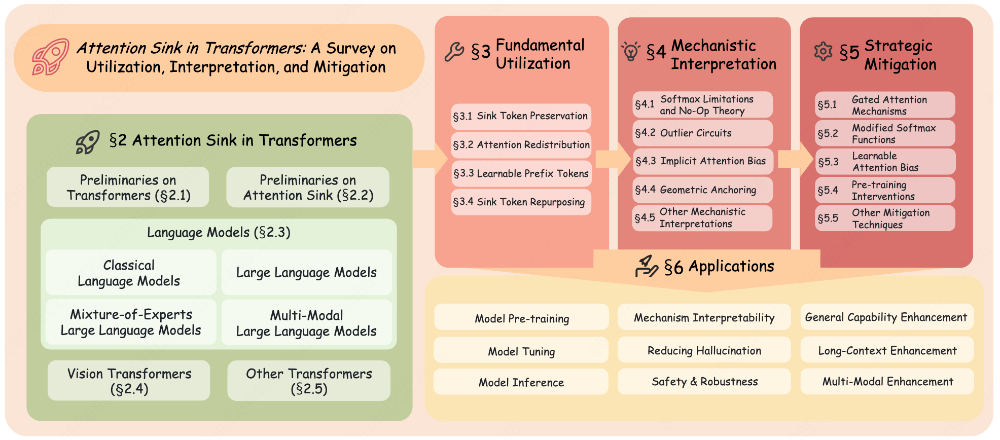
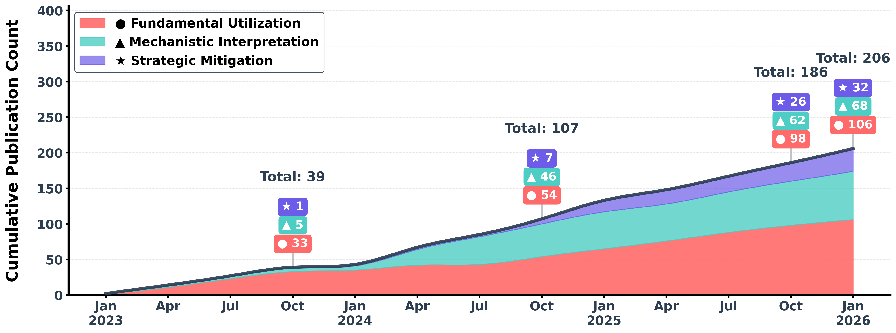

<h1 align="center">🚀 Attention Sink in Transformers: <br> A Survey on Utilization, Interpretation, and Mitigation</h1>

<div align="center">

[](https://arxiv.org/pdf/2604.10098)
[]()
[](https://arxiv.org/abs/2604.10098)

[](https://awesome.re)
[](https://github.com/ZunhaiSu/Awesome-Attention-Sink/stargazers)

</div>

<div align="center">
  ⭐ If you find this repository helpful, please consider giving it a star.
</div>

---

## 📚 Table of Contents

- [Latest News](#-latest-news)
- [Overview](#-overview)
- [Paper List](#-paper-list)
  - [Classical Language Models](#classical-language-models)
  - [Large Language Models](#large-language-models)
  - [Mixture-of-Experts Large Language Models](#mixture-of-experts-large-language-models)
  - [Multi-Modal Large Language Models](#multi-modal-large-language-models)
  - [Vision Transformers](#vision-transformers)
  - [Diffusion Transformers](#diffusion-transformers)
  - [Diffusion Language Models](#diffusion-language-models)
  - [Hybrid Linear Attention Models](#hybrid-linear-attention-models)
  - [Vision-Language-Action Models](#vision-language-action-models)
  - [General Transformers](#general-transformers)
- [Citation](#-citation)
- [Contact](#-contact)

---

## 🔥 Latest News

- **[2026-04-14]** ✨ We thank all related works for their contributions to AS-related research. We are currently fine-tuning the paper for journal submission. For any inquiries or to include your work in the paper list, please contact us at [zh-su23@mails.tsinghua.edu.cn](mailto:zh-su23@mails.tsinghua.edu.cn).
- **[2026-04-14]** 🎉 Our survey paper *"Attention Sink in Transformers: A Survey on Utilization, Interpretation, and Mitigation"* is now available on arXiv! [[Link](https://arxiv.org/abs/2604.10098)]
- **[2026-04-11]** 🚀 Repository launched to track the latest progress in Attention Sink research.

---

## 📖 Overview

This repository organizes papers on **Attention Sink (AS)** — where Transformers disproportionately focus on uninformative tokens, causing interpretability issues, training/inference inefficiencies, and hallucinations.

<div align="center">
  
  <br>
  <em>Figure 1: Overview of the survey structure.</em>
</div>

<br>

**We have systematically reviewed the development of AS research**, identifying a clear trajectory across three stages. Our survey further grounds this framework by examining how each stage manifests across different Transformer architectures.

<div align="center">
  
  <br>
  <em>Figure 2: Cumulative publication count and temporal trends in AS research (2023–2026).</em>
</div>

<br>

### Three Research Stages

**① Fundamental Utilization** (2023–present)
> Empirical exploitation of AS and management of its immediate effects.
> *Approaches include:* Sink Token Preservation, Attention Redistribution, Learnable Prefix Tokens, Sink Token Repurposing.

**② Mechanistic Interpretation** (2024–present)
> Investigation of underlying causes and architectural factors.
> *Theories include:* Softmax Limitations & No-Op Theory, Outlier Circuits, Implicit Attention Bias, Geometric Anchoring and others.

**③ Strategic Mitigation** (2025–present)
> Direct structural mitigation for training stability and deployment robustness.
> *Strategies include:* Gated Attention Mechanisms, Modified Softmax Functions, Learnable Attention Bias, Pre-training Interventions and others.

---

## 📑 Paper List

> Each paper is annotated with tags corresponding to specific aspects of Fundamental Utilization, Mechanistic Interpretation, and Strategic Mitigation of AS. As most studies do not target all three key aspects, the symbol `—` denotes the absence of a particular dimension in a given work.

### Classical Language Models
| Paper | Year | Exploitation | Understanding | Elimination | Application | Venue | Link |
| :---: | :---: | :---: | :---: | :---: | :---: | :---: | :---: |
| **What are you sinking? a geometric approach on attention sink** | 2025 | - | Geometric Anchoring | - | Mechanism Interpretability | NeurIPS | [Link](https://arxiv.org/abs/2508.02546) |
| **Ctr-sink: Attention sink for language models in click-through rate prediction** | 2025 | Sink Token Preservation | Geometric Anchoring | - | General Capability Enhancement | ArXiv | [Link](https://arxiv.org/abs/2508.03668) |
| **Does roberta perform better than bert in continual learning: An attention sink perspective** | 2024 | Attention Redistribution | - | - | General Capability Enhancement, Long-Context Enhancement | COLM | [Link](https://arxiv.org/abs/2410.05648) |
| **Quantizable transformers: Removing outliers by helping attention heads do nothing** | 2023 | - | Softmax Limitations & No-Op Theory, Outlier Circuits | Gated Attention, Modified Softmax | Model Inference, Model Pre-training, Mechanism Interpretability | NeurIPS | [Link](https://arxiv.org/abs/2306.12929) |
| **Outliers dimensions and attention sinks in language models** | 2022 | - | Outlier Circuits | - | Mechanism Interpretability | EMNLP | [Link](https://arxiv.org/abs/2205.11380) |
| **Structural bias in the transformer** | 2021 | - | Outlier Circuits, Structural Bias | - | Mechanism Interpretability | ACL | [Link](https://arxiv.org/abs/2011.04393) |
| **Revealing the dark secrets of BERT** | 2021 | - | Outlier Circuits | - | Mechanism Interpretability | ACL | [Link](https://arxiv.org/abs/2105.06990) |
| **Understanding and overcoming the challenges of efficiently quantizing transformer-based models** | 2021 | Sink Token Preservation | Outlier Circuits | - | Model Inference, Mechanism Interpretability | EMNLP | [Link](https://arxiv.org/abs/2109.12948) |
| **What does bert look at?** | 2019 | - | Outlier Circuits | - | Mechanism Interpretability | ACL | [Link](https://arxiv.org/abs/1906.04341) |


### Large Language Models
| Paper | Year | Exploitation | Understanding | Elimination | Application | Venue | Link |
| :---: | :---: | :---: | :---: | :---: | :---: | :---: | :---: |
| **The spike, the sparse and the sink: Anatomy of massive activations and attention sinks** | 2026 | - | - | - | Mechanism Interpretability | Arxiv | [Link](https://arxiv.org/abs/2603.05498) |
| **Attention sinks induce gradient sinks** | 2026 | - | - | - | Mechanism Interpretability | Arxiv | [Link](https://arxiv.org/abs/2603.17771) |
| **SinkTrack: KV-cache compression via attention sink preservation** | 2026 | Sink Token Preservation | - | - | Long-Context Enhancement, Reducing Hallucination | ICLR | [Link](https://openreview.net/forum?id=Gg1aPETCL6) |
| **Zerotuning: Unlocking the initial token's power to enhance large language models without training** | 2026 | Attention Redistribution | Implicit Attention Bias, Softmax Limitations & No-Op Theory | - | General Capability Enhancement, Mechanism Interpretability | ICLR | [Link](https://openreview.net/forum?id=EdkQ14FiiO) |
| **Attention sinks and compression valleys in llms are two sides of the same coin** | 2026 | - | Outlier Circuits, Mix-Compress-Refine Theory | - | Mechanism Interpretability | ICLR | [Link](https://openreview.net/forum?id=c5TFhCJ6fs) |
| **Softmax limitations and the necessity of attention sinks** | 2026 | - | Softmax Limitations & No-Op Theory | Pre-training Interventions | Mechanism Interpretability | Arxiv | [Link](https://arxiv.org/abs/2602.01203) |
| **Surgery: A pre-training intervention to prevent attention sinks** | 2026 | Sink Token Repurposing | - | Pre-training Interventions | Model Tuning | Arxiv | [Link](https://arxiv.org/abs/2602.05228) |
| **A Unified View of Attention and Residual Sinks: Outlier-Driven Rescaling is Essential for Transformer Training** | 2026 | - | Outlier-Driven Rescaling Theory | Gated Attention | Model Pre-training, Safety & Robustness | Arxiv | [Link](https://arxiv.org/abs/2601.22966) |
| **MiMo-V2-Flash Technical Report** | 2026 | - | - | Learnable Attention Bias | Model Pre-training, Long-Context Enhancement | ArXiv | [Link](https://arxiv.org/abs/2601.02780) |
| **Attention Needs to Focus: A Unified Perspective on Attention Allocation** | 2026 | - | Softmax Limitations & No-Op Theory, Structural Bias | Modified Softmax, Learnable Attention Bias | Mechanism Interpretability | Arxiv | [Link](https://www.arxiv.org/abs/2601.00919) |
| **Hybrid linear attention done right: Efficient distillation and effective architectures for extremely long contexts** | 2026 | - | - | Gated Attention | Model Pre-training | Arxiv | [Link](https://arxiv.org/abs/2601.22156) |
| **SWAA: Sliding Window Attention Adaptation for Efficient Long-Context LLMs Without Pretraining** | 2025 | Sink Token Preservation | - | - | Long-Context Enhancement | Arxiv | [Link](https://arxiv.org/abs/2512.10411) |
| **On the Existence and Behaviour of Secondary Attention Sinks** | 2025 | - | - | - | Mechanism Interpretability | Arxiv | [Link](https://arxiv.org/abs/2512.22213) |
| **TWEO: Transformers Without Extreme Outliers Enables FP8 Training And Quantization For Dummies** | 2025 | - | Outlier Circuits | Pre-training Interventions | Model Pre-training | Arxiv | [Link](https://arxiv.org/abs/2511.23225) |
| **DoPE: Denoising Rotary Position Embedding** | 2025 | Attention Redistribution | Structural Bias | - | Long-Context Enhancement, Mechanism Interpretability | Arxiv | [Link](https://arxiv.org/abs/2511.09146) |
| **Value-State Gated Attention for Mitigating Extreme-Token Phenomena in Transformers** | 2025 | - | Softmax Limitations & No-Op Theory, Outlier Circuits | Gated Attention | Model Inference, Model Pre-training, Mechanism Interpretability | Arxiv | [Link](https://arxiv.org/abs/2510.09017) |
| **H2O: Heavy-Hitter Oracle for Efficient Generative Inference of Large Language Models** | 2023 | Sink Token Preservation | - | - | Model Inference | NeurIPS | [Link](https://proceedings.neurips.cc/paper_files/paper/2023/hash/6ceefa7b15572587b78ecfcebb2827f8-Abstract-Conference.html) |
| **Snapkv: Optimizing kv cache for llm inference via snapshotting** | 2024 | Sink Token Preservation | - | - | Model Inference | Arxiv | [Link](https://arxiv.org/abs/2404.14469) |
| **Scissorhands: Exploiting the persistence of importance in large language model kv cache** | 2023 | Sink Token Preservation | - | - | Model Inference | Arxiv | [Link](https://arxiv.org/abs/2305.17118) |
| **ShadowKV: Optimizing KV Cache for Long-context LLM Inference via Shadow States** | 2024 | Sink Token Preservation | - | - | Model Inference | ICLR | [Link](https://arxiv.org/abs/2410.10819) |
| **MiniCache: Efficient KV Cache Compression for Large Language Models** | 2024 | Sink Token Preservation | - | - | Model Inference | Arxiv | [Link](https://arxiv.org/abs/2405.14365) |
| **Forgetting to Forget: Attention Sink as A Gateway for Backdooring LLM Unlearning** | 2025 | Sink Tokens Repurposing, Structural Bias | - | - | Safety & Robustness, Mechanism Interpretability | Arxiv | [Link](https://arxiv.org/abs/2510.17021) |
| **PyramidKV: Dynamic KV Cache Compression based on Pyramidal Information Funneling** | 2024 | Sink Token Preservation | - | - | Model Inference | Arxiv | [Link](https://arxiv.org/abs/2406.02069) |
| **SCOPE: Optimizing Key-Value Cache Compression in Long-context Generation** | 2025 | Sink Token Preservation | - | - | Model Inference | ACL | [Link](https://arxiv.org/abs/2412.13649) |
| **Hybrid Architectures for Language Models: Systematic Analysis and Design Insights** | 2025 | Sink Token Preservation | - | - | Model Inference | Arxiv | [Link](https://arxiv.org/abs/2510.04800) |
| **Lost in the Middle: An Emergent Property from Information Retrieval Demands in LLMs** | 2025 | - | Structural Bias | - | Mechanism Interpretability | Arxiv | [Link](https://arxiv.org/abs/2510.10276) |
| **Quest: Query-aware Sparsity for Efficient Long-context LLM Inference** | 2024 | Sink Token Preservation | - | - | Model Inference | Arxiv | [Link](https://arxiv.org/abs/2406.10774) |
| **All for One: LLMs Solve Mental Math at the Last Token With Information Transferred From Other Tokens** | 2025 | - | - | - | Mechanism Interpretability | Arxiv | [Link](https://arxiv.org/abs/2509.09650) |
| **LongCat-Flash Technical Report** | 2025 | - | - | Pre-training Interventions | Model Pre-training | Arxiv | [Link](https://arxiv.org/abs/2509.01322) |
| **H2EAL: Hybrid-Bonding Architecture with Hybrid Sparse Attention for Efficient Long-Context LLM Inference** | 2025 | Sink Token Preservation | - | - | Model Inference | ICCAD | [Link](https://arxiv.org/abs/2508.16653) |
| **Integral Transformer: Denoising Attention, Not Too Much Not Too Little** | 2025 | - | - | Modified Softmax | General Capability Enhancement | Arxiv | [Link](https://arxiv.org/abs/2508.18387) |
| **CTR-Sink: Attention Sink for Language Models in Click-Through Rate Prediction** | 2025 | Sink Token Preservation, Geometric Anchoring | - | - | General Capability Enhancement | Arxiv | [Link](https://arxiv.org/abs/2508.03668) |
| **What are you sinking? a geometric approach on attention sink** | 2025 | - | Geometric Anchoring | - | Mechanism Interpretability | NeurIPS | [Link](https://arxiv.org/abs/2405.06730) |
| **gpt-oss-120b & gpt-oss-20b model card** | 2025 | - | - | Learnable Attention Bias | Model Pre-training | Arxiv | [Link](https://arxiv.org/abs/2508.10925) |
| **KVSink: Understanding and overcoming the challenges of efficiently quantizing transformer-based models** | 2025 | Sink Token Preservation | Softmax Limitations & No-Op Theory, Outlier Circuits | - | Model Inference, Mechanism Interpretability | COLM | [Link](https://arxiv.org/abs/2410.12345) |
| **Deltallm: A training-free framework exploiting temporal sparsity for efficient edge llm inference** | 2025 | Sink Token Preservation | - | - | Model Inference | Arxiv | [Link](https://arxiv.org/abs/2507.12345) |
| **Earn: Efficient inference acceleration for llm-based generative recommendation by register tokens** | 2025 | Learnable Prefix Tokens | - | - | Model Inference, Mechanism Interpretability | KDD | [Link](https://arxiv.org/abs/2410.05678) |
| **Orthorank: Token selection via sink token orthogonality for efficient llm inference** | 2025 | Sink Token Preservation | Geometric Anchoring | - | Model Inference, Mechanism Interpretability | ICML | [Link](https://arxiv.org/abs/2501.03456) |
| **Trianglemix: Accelerating prefilling via decoding-time contribution sparsity** | 2025 | Sink Token Preservation | - | - | Model Inference | Arxiv | [Link](https://arxiv.org/abs/2507.21526) |
| **Unveiling Super Experts: Understanding and Harvesting Attention Sinks in MoE LLMs** | 2026 | - | Outlier Circuits | - | Model Inference, Mechanism Interpretability | ICLR | [Link](https://arxiv.org/abs/2410.15113) |
| **L-Eval: Instituting Standardized Evaluation for Long-context Language Models** | 2025 | Sink Token Preservation | - | - | Model Inference | Arxiv | [Link](https://arxiv.org/abs/2307.11088) |
| **Attention Store: Cost-effective KV Cache Management for Large Language Models** | 2025 | Sink Token Preservation | - | - | Model Inference, Mechanism Interpretability | Arxiv | [Link](https://arxiv.org/abs/2403.11111) |
| **A closer look at the attention sink phenomenon: Towards a better understanding of attention patterns** | 2025 | Sink Token Preservation | Outlier Circuits | Pre-training Interventions | Model Pre-training | ACL | [Link](https://arxiv.org/abs/2409.12345) |
| **Delta attention: Fast and accurate sparse attention inference by delta correction** | 2025 | - | - | - | Model Inference | Arxiv | [Link](https://arxiv.org/abs/2410.05648) |
| **Gated attention: Helping attention heads do nothing** | 2025 | Sink Tokens Repurposing | Softmax Limitations & No-Op Theory | Gated Attention | Model Inference, Model Pre-training, Long-Context Enhancement, Mechanism Interpretability | NeurIPS | [Link](https://arxiv.org/abs/2406.12345) |
| **Keydiff: Key similarity-based kv cache eviction for long-context llm inference** | 2025 | Sink Token Preservation | Geometric Anchoring | - | Model Inference, Mechanism Interpretability | NeurIPS | [Link](https://arxiv.org/abs/2410.05678) |
| **Anti-Overmixing: Towards Deeper Understanding of Attention Sinks** | 2025 | - | Anti-Overmixing | - | Mechanism Interpretability | COLM | [Link](https://arxiv.org/abs/2407.01234) |
| **Softpick: No attention sink, no massive activations with rectified softmax** | 2025 | - | Softmax Limitations & No-Op Theory, Outlier Circuits | Modified Softmax | Model Inference, Model Pre-training, Mechanism Interpretability | Arxiv | [Link](https://arxiv.org/abs/2410.01234) |
| **Efficient many-shot in-context learning with dynamic block-sparse attention** | 2025 | Sink Token Preservation | - | - | Model Inference | ACL | [Link](https://arxiv.org/abs/2410.15678) |
| **Interpreting the repeated token phenomenon in transformers** | 2025 | - | Outlier Circuits | - | Mechanism Interpretability, Safety & Robustness | ICML | [Link](https://arxiv.org/abs/2410.01234) |
| **Edgeinfinite: A memory-efficient infinite-context transformer for edge devices** | 2025 | Sink Token Preservation | - | - | Long-Context Enhancement | ACL | [Link](https://arxiv.org/abs/2410.15678) |
| **Sliding window attention training for efficient large language models** | 2025 | - | Softmax Limitations & No-Op Theory | Modified Softmax | Long-Context Enhancement | Arxiv | [Link](https://arxiv.org/abs/2502.18845) |
| **Systematic outliers in large language models** | 2025 | - | Outlier Circuits, Implicit Attention Bias | Learnable Attention Bias | Model Pre-training, Mechanism Interpretability | ICLR | [Link](https://arxiv.org/abs/2502.06415) |
| **On the emergence of position bias in transformers** | 2025 | - | Structural Bias | - | Mechanism Interpretability | ICML | [Link](https://arxiv.org/abs/2502.01951) |
| **Cache me if you must: Adaptive key-value quantization for large language models** | 2025 | Sink Token Preservation | - | - | Model Inference | ICML | [Link](https://arxiv.org/abs/2501.19392) |
| **Unigist: Towards general and hardware-aligned sequence-level long context compression** | 2025 | Learnable Prefix Tokens | - | - | NeurIPS, Model Inference | NeurIPS | [Link](https://arxiv.org/abs/2509.15763) |
| **Llms know what to drop: Self-attention guided kv cache eviction for efficient long-context inference** | 2025 | Sink Token Preservation | - | - | Model Inference | ArXiv | [Link](https://arxiv.org/abs/2503.08879) |
| **Task-kv: Task-aware kv cache optimization via semantic differentiation of attention heads** | 2025 | Sink Token Preservation | - | - | Model Inference | ArXiv | [Link](https://arxiv.org/abs/2501.15113) |
| **Weight-based analysis of detokenization in language models: Understanding the first stage of inference without inference** | 2025 | - | Implicit Attention Bias | - | Mechanism Interpretability | NAACL | [Link](https://arxiv.org/abs/2501.01103) |
| **Rotatekv: Accurate and robust 2-bit kv cache quantization for Ilms via outlier-aware adaptive rotations** | 2025 | Sink Token Preservation, Outlier Circuits | - | - | Model Inference | IJCAI | [Link](https://arxiv.org/abs/2402.16342) |
| **Variance sensitivity induces attention entropy collapse in transformers** | 2025 | - | Softmax Limitations & No-Op Theory | Modified Softmax | Model Pre-training, Mechanism Interpretability | EMNLP | [Link](https://arxiv.org/abs/2410.01529) |
| **Leank: Learnable k cache channel pruning for efficient decoding** | 2025 | Sink Token Preservation | - | - | Model Inference | EMNLP | [Link](https://arxiv.org/abs/2410.05151) |
| **Look both ways and no sink: Converting llms into text encoders without training** | 2025 | Sink Tokens Repurposing | - | - | General Capability Enhancement | ACL | [Link](https://arxiv.org/abs/2405.15282) |
| **Anchor attention, small cache: Code generation with large language models** | 2025 | Sink Token Preservation, Geometric Anchoring | - | - | Model Inference, Mechanism Interpretability | Arxiv | [Link](https://arxiv.org/abs/2401.01423) |
| **Evolving sparsity: Leveraging token importance dynamics for efficient Ilm decoding with sparse attention** | 2025 | Sink Token Preservation | - | - | Model Inference | Arxiv | [Link](https://arxiv.org/abs/2510.09883) |
| **Subkv: Quantizing long context kv cache for sub-billion parameter language models on edge devices** | 2025 | Sink Token Preservation | - | - | Model Inference | Arxiv | [Link](https://arxiv.org/abs/2501.01103) |
| **Entropy-guided kv caching for efficient Ilm inference** | 2025 | Sink Token Preservation | - | - | Model Inference | Arxiv | [Link](https://arxiv.org/abs/2503.08879) |
| **Initial-key cache: An efficient kv cache strategy focusing on initial and key tokens for llms** | 2025 | Softmax Limitations & No-Op Theory, Sink Token Preservation | - | - | Model Inference | IJCNN | [Link](https://arxiv.org/abs/2501.15113) |
| **Sgd-kv: Summarization guided kv cache compression** | 2025 | Sink Token Preservation | - | - | NeurIPS, Model Inference | NeurIPS | [Link](https://arxiv.org/abs/2501.19392) |
| **Attention entropy is a key factor: An analysis of parallel context encoding with full-attention-based pre-trained language models** | 2025 | Sink Token Preservation, Softmax Limitations & No-Op Theory | - | - | Long-Context Enhancement, Mechanism Interpretability | ACL | [Link](https://arxiv.org/abs/2410.01529) |
| **The singular anchor: First token dominance in large language model attention sinks** | 2025 | - | - | - | Mechanism Interpretability | NeurIPS | [Link](https://arxiv.org/abs/2411.17116) |
| **Attention sinks: A 'catch, tag, release' mechanism for embeddings** | 2025 | Softmax Limitations & No-Op Theory | - | Modified Softmax | Mechanism Interpretability | Arxiv | [Link](https://arxiv.org/abs/2410.17174) |
| **Attention sinks: A 'catch, tag, release' mechanism for embeddings** | 2025 | - | Outlier Circuits | - | Mechanism Interpretability | NeurIPS | [Link](https://arxiv.org/abs/2410.17174) |
| **Position bias mitigates position bias: Mitigate position bias through inter-position knowledge distillation** | 2025 | Attention Redistribution, Structural Bias | - | - | General Capability Enhancement | EMNLP | [Link](https://arxiv.org/abs/2502.01951) |
| **Dfrot: Achieving outlier-free and massive activation-free for rotated Ilms with refined rotation** | 2025 | - | Outlier Circuits | Pre-training Interventions | Model Inference | COLM | [Link](https://arxiv.org/abs/2410.10781) |
| **Star attention: Efficient Ilm inference over long sequences** | 2025 | Sink Token Preservation | - | - | Model Inference, Long-Context Enhancement | ICML | [Link](https://arxiv.org/abs/2411.17116) |
| **From attention to activation: Unravelling the enigmas of large language models** | 2025 | - | Outlier Circuits, Softmax Limitations & No-Op Theory | Modified Softmax, Pre-training Interventions | Model Inference, Mechanism Interpretability | ICLR | [Link](https://arxiv.org/abs/2410.17174) |
| **Magicpig: Lsh sampling for efficient Ilm generation** | 2025 | Sink Token Preservation, Geometric Anchoring | - | - | Model Inference, Long-Context Enhancement, Mechanism Interpretability | ICLR | [Link](https://arxiv.org/abs/2410.16139) |
| **A little goes a long way: Efficient long context training and inference with partial contexts** | 2025 | Sink Token Preservation | - | - | Model Inference, Model Pre-training, Long-Context Enhancement | ICLR | [Link](https://arxiv.org/abs/2410.10870) |
| **Duoattention: Efficient long-context Ilm inference with retrieval and streaming heads** | 2025 | Sink Token Preservation | - | - | Model Inference, Long-Context Enhancement | ICLR | [Link](https://arxiv.org/abs/2410.10870) |
| **Epic: Efficient position-independent caching for serving large language models** | 2025 | Learnable Prefix Tokens, Outlier Circuits | - | - | Model Inference | ICML | [Link](https://arxiv.org/abs/2411.17116) |
| **When attention sink emerges in language models: An empirical view** | 2025 | - | Softmax Limitations, Implicit Attention Bias | Modified Softmax, Learnable Attention Bias | Mechanism Interpretability | ICLR | [Link](https://arxiv.org/abs/2410.10781) |
| **Unveiling and harnessing hidden attention sinks: Enhancing large language models without training through attention calibration** | 2025 | Attention Redistribution | - | - | General Capability Enhancement | ICML | [Link](https://arxiv.org/abs/2406.15682) |
| **Prefixquant: Eliminating outliers by prefixed tokens for large language models quantization** | 2024 | Sink Token Preservation | - | - | Model Inference | Arxiv | [Link](https://arxiv.org/abs/2410.05265) |
| **Buzz: Beehive-structured sparse kv cache with segmented heavy hitters for efficient Ilm inference** | 2024 | Sink Token Preservation | - | - | Model Inference | Arxiv | [Link](https://arxiv.org/abs/2410.23079) |
| **Active-dormant attention heads: Mechanistically demystifying extreme-token phenomena in llms** | 2024 | - | Softmax Limitations & No-Op Theory, Outlier Circuits, Active-Dormant Theory | - | Mechanism Interpretability | Arxiv | [Link](https://arxiv.org/abs/2410.13835) |
| **Unveiling and controlling anomalous attention distribution in transformers** | 2024 | - | Structural Bias | - | Model Inference, Mechanism Interpretability | Arxiv | [Link](https://arxiv.org/abs/2407.01601) |
| **A2sf: Accumulative attention scoring with forgetting factor for token pruning in transformer decoder** | 2024 | Softmax Limitations & No-Op Theory, Structural Bias, Attention Redistribution | - | - | Model Inference | Arxiv | [Link](https://arxiv.org/abs/2407.20485) |
| **Attention score is not all you need for token importance indicator in kv cache reduction: Value also matters** | 2024 | Sink Token Preservation, Outlier Circuits | - | - | Model Inference | EMNLP | [Link](https://arxiv.org/abs/2401.18079) |
| **Pyramidkv: Dynamic kv cache compression based on pyramidal information funneling** | 2024 | Sink Token Preservation | - | - | Model Inference | Arxiv | [Link](https://arxiv.org/abs/2406.02069) |
| **Sinklora: Enhanced efficiency and chat capabilities for long-context large language models** | 2024 | Learnable Prefix Tokens | - | - | Model Inference, Long-Context Enhancement | Arxiv | [Link](https://arxiv.org/abs/2406.05678) |
| **Prefixing attention sinks can mitigate activation outliers for large language model quantization** | 2024 | Learnable Prefix Tokens, Outlier Circuits | - | - | Model Inference | EMNLP | [Link](https://arxiv.org/abs/2410.05265) |
| **Transformers need glasses! information over-squashing in language tasks** | 2024 | - | Anti-Overmixing | - | Mechanism Interpretability | NeurIPS | [Link](https://arxiv.org/abs/2410.10781) |
| **Skvq: Sliding-window key and value cache quantization for large language models** | 2024 | Sink Token Preservation | - | - | Model Inference | COLM | [Link](https://arxiv.org/abs/2401.18079) |
| **Intactkv: Improving large language model quantization by keeping pivot tokens intact** | 2024 | Sink Token Preservation, Outlier Circuits | - | - | Model Inference | ACL | [Link](https://arxiv.org/abs/2403.01241) |
| **Is it a free lunch for removing outliers during pretraining?** | 2024 | Sink Token Preservation, Outlier Circuits | - | - | Model Inference, Mechanism Interpretability | Arxiv | [Link](https://arxiv.org/abs/2402.12102) |
| **Massive activations in large language models** | 2024 | - | Outlier Circuits, Implicit Attention Bias | Learnable Attention Bias | Mechanism Interpretability | COLM | [Link](https://arxiv.org/abs/2402.17762) |
| **Spectral filters, dark signals, and attention sinks** | 2024 | - | Spectral-Energy Association | - | Mechanism Interpretability | ACL | [Link](https://arxiv.org/abs/2410.01529) |
| **Universal neurons in gpt2 language models** | 2024 | - | Outlier Circuits | - | Mechanism Interpretability | TMLR | [Link](https://arxiv.org/abs/2410.23079) |
| **Zero-shot rtl code generation with attention sink augmented large language models** | 2024 | Learnable Prefix Tokens | - | - | General Capability Enhancement | Arxiv | [Link](https://arxiv.org/abs/2401.08683) |
| **Kvquant: Towards 10 million context length llm inference with kv cache quantization** | 2024 | Sink Token Preservation | - | - | Model Inference | NeurIPS | [Link](https://arxiv.org/abs/2401.18079) |
| **With greater text comes greater necessity: Inference-time training helps long text generation** | 2024 | Sink Token Preservation | - | - | Model Inference, Long-Context Enhancement, Mechanism Interpretability | COLM | [Link](https://arxiv.org/abs/2410.17174) |
| **What rotary position embedding can tell us: Identifying query and key weights corresponding to basic syntactic or high-level semantic information** | 2024 | - | Softmax Limitations & No-Op Theory, Structural Bias | - | Model Tuning, Model Inference, Long-Context Enhancement, Mechanism Interpretability | NeurIPS | [Link](https://arxiv.org/abs/2410.13835) |
| **Exploring context window of large language models via decomposed positional vectors** | 2024 | - | Geometric Anchoring | - | Mechanism Interpretability | NeurIPS | [Link](https://arxiv.org/abs/2410.16139) |
| **Streamingdialogue: Prolonged dialogue learning via long context compression with minimal losses** | 2024 | Sink Tokens Repurposing | - | - | Model Inference, Long-Context Enhancement | NeurIPS | [Link](https://arxiv.org/abs/2410.10870) |
| **Q-hitter: A better token oracle for efficient Ilm inference via sparse-quantized kv cache** | 2024 | Sink Token Preservation | - | - | Model Inference | MLSys | [Link](https://arxiv.org/abs/2401.18079) |
| **Infllm: Training-free long-context extrapolation for llms with an efficient context memory** | 2024 | Sink Token Preservation | - | - | Model Inference | NeurIPS | [Link](https://arxiv.org/abs/2402.04617) |
| **Get It for Free: Infinite-Context Transformers with Context Selection** | 2024 | Sink Token Preservation | - | - | Model Inference | NAACL | [Link](https://arxiv.org/abs/2407.20485) |
| **Minference 1.0: Accelerating pre-filling for long-context llms via dynamic sparse attention** | 2024 | Sink Token Preservation | - | - | Model Inference | NeurIPS | [Link](https://arxiv.org/abs/2407.02490) |
| **Massive Sinks: Characterizing and Utilizing Sinks in Long-Context LLMs** | 2024 | Sink Token Preservation | - | - | Model Inference | ICLR | [Link](https://arxiv.org/abs/2407.02490) |
| **Efficient streaming language models with attention sinks** | 2024 | Sink Token Preservation, Softmax Limitations & No-Op Theory, Learnable Prefix Tokens | - | - | Long-Context Enhancement, Mechanism Interpretability | ICLR | [Link](https://arxiv.org/abs/2309.17453) |
| **H2o: Heavy-hitter oracle for efficient generative inference of large language models** | 2023 | Sink Token Preservation | - | - | Model Inference | NeurIPS | [Link](https://arxiv.org/abs/2306.14048) |
| **Bert busters: Outlier dimensions that disrupt transformers** | 2021 | - | Outlier Circuits | - | Mechanism Interpretability | ACL | [Link](https://arxiv.org/abs/2105.06995) |

### Mixture-of-Experts Large Language Models
| Paper | Year | Exploitation | Understanding | Elimination | Application | Venue | Link |
| :---: | :---: | :---: | :---: | :---: | :---: | :---: | :---: |
| **Mimo-v2-flash technical report** | 2026 | - | - | Learnable Attention Bias | Model Pre-training, Long-Context Enhancement | ArXiv | [Link](https://arxiv.org/abs/2601.02780) |
| **Research and latest advancements (Qwen AI)** | 2026 | - | - | Gated Attention | Model Pre-training | Arxiv | [Link](https://qwenlm.github.io/blog/qwen2.5-1m/) |
| **Longcat-flash technical report** | 2025 | - | - | Pre-training Interventions | Model Pre-training | ArXiv | [Link](https://arxiv.org/abs/2509.01322) |
| **H2eal: Hybrid-bonding architecture with hybrid sparse attention for efficient long-context Ilm inference** | 2025 | Sink Token Preservation | - | - | Model Inference | ICCAD | [Link](https://arxiv.org/abs/2501.19392) |
| **gpt-oss-120b & gpt-oss-20b model card** | 2025 | - | - | Learnable Attention Bias | Model Pre-training | Arxiv | [Link](https://arxiv.org/abs/2508.10925) |
| **Unveiling super experts in mixture-of-experts large language models** | 2025 | - | Outlier Circuits | - | Model Inference, Mechanism Interpretability | Arxiv | [Link](https://arxiv.org/abs/2510.09017) |
| **Gated attention for large language models: Non-linearity, sparsity, and attention-sink-free** | 2025 | - | Softmax Limitations & No-Op Theory | Gated Attention | Model Inference, Model Pre-training, Long-Context Enhancement, Mechanism Interpretability | NeurIPS | [Link](https://arxiv.org/abs/2411.17116) |
| **Massive activations in large language models** | 2024 | - | Outlier Circuits, Implicit Attention Bias | Learnable Attention Bias | Mechanism Interpretability | COLM | [Link](https://arxiv.org/abs/2402.17762) |


### Multi-Modal Large Language Models
| Paper | Year | Exploitation | Understanding | Elimination | Application | Venue | Link |
| :---: | :---: | :---: | :---: | :---: | :---: | :---: | :---: |
| **Sinktrack: Attention sink based context anchoring for large language models** | 2026 | Sink Token Preservation | - | - | Long-Context Enhancement, Reducing Hallucination | ICLR | [Link](https://arxiv.org/abs/2602.10718) |
| **Vlm-sink: Visual attention sink for large multimodal models** | 2026 | Sink Token Preservation | - | - | Multi-Modal Enhancement, Mechanism Interpretability | ICLR | [Link](https://arxiv.org/abs/2601.16725) |
| **Attention reallocation: Towards zero-cost and controllable hallucination mitigation of mllms** | 2026 | Attention Redistribution | - | - | Reducing Hallucination, MultiModal-Enhancement | IJCV | [Link](https://arxiv.org/abs/2510.07651) |
| **Omnisparse: Efficient long-video mllm with memory-anchored sparse attention** | 2025 | Sink Tokens Repurposing, Geometric Anchoring | - | - | Model Inference, Mechanism Interpretability | ArXiv | [Link](https://arxiv.org/abs/2509.15763) |
| **Mitigating attention sinks and massive activations in audio-visual speech recognition with Ilms** | 2025 | - | Outlier Circuits | Pre-training Interventions | General Capability Enhancement, Mechanism Interpretability | ArXiv | [Link](https://arxiv.org/abs/2510.22603) |
| **SparseVILA: Towards efficient visual-language models via sparse-quantized kv cache** | 2025 | Sink Token Preservation | - | - | Model Inference, MultiModal-Enhancement | CVPR | [Link](https://arxiv.org/abs/2410.05265) |
| **Saliency-aware kv cache compression for efficient mllm inference** | 2025 | Sink Token Preservation | - | - | Model Inference | EMNLP | [Link](https://arxiv.org/abs/2501.01103) |
| **Pevlm: Parameter-efficient vision-language models with sink token preservation** | 2025 | Sink Token Preservation | - | - | Model Inference | Arxiv | [Link](https://arxiv.org/abs/2501.15113) |
| **How do large vision-language models see text in image? unveiling the distinctive role of ocr heads** | 2025 | Attention Redistribution | - | - | Multi-Modal Enhancement | EMNLP | [Link](https://arxiv.org/abs/2501.19392) |
| **Don't deceive me: Mitigating gaslighting through attention reallocation in Imms** | 2025 | Attention Redistribution | - | - | Reducing Hallucination | Arxiv | [Link](https://arxiv.org/abs/2504.09456) |
| **See what you are told: Visual attention sink in large multimodal models** | 2025 | Attention Redistribution | Outlier Circuits | - | Multi-Modal Enhancement, Mechanism Interpretability | ICLR | [Link](https://arxiv.org/abs/2410.16139) |
| **Vasparse: Towards efficient visual hallucination mitigation via visual-aware token sparsification** | 2025 | Attention Redistribution | - | - | Reducing Hallucination | CVPR | [Link](https://arxiv.org/abs/2501.19392) |
| **Akvq-vl: Attention-aware kv cache adaptive 2-bit quantization for vision-language models** | 2025 | Sink Token Preservation | Outlier Circuits | - | Model Inference | ICME | [Link](https://arxiv.org/abs/2501.01103) |
| **Tale: Token-adaptive low-rank kvcache approximation with reconstruction elimination** | 2025 | Sink Token Preservation | - | - | Model Inference | Arxiv | [Link](https://arxiv.org/abs/2503.08879) |
| **Coffee: Mitigating hallucination in Ivlms via collaborative filtering for enhanced eyes** | 2025 | Attention Redistribution | - | - | Mechanism Interpretability, Reducing Hallucination | ICCEA | [Link](https://arxiv.org/abs/2501.15113) |
| **Visipruner: Decoding discontinuous cross-modal dynamics for efficient multimodal Ilms** | 2025 | Sink Token Preservation | - | - | Model Inference, Mechanism Interpretability | EMNLP | [Link](https://arxiv.org/abs/2501.15113) |
| **Seed-story: Multimodal long story generation with large language model** | 2025 | Sink Token Preservation | - | - | Long-Context Enhancement | CVPR | [Link](https://arxiv.org/abs/2410.01529) |
| **Vocabulary fixation reveals visual attention sink for hallucination mitigation in lvlms** | 2025 | Attention Redistribution | - | - | Reducing Hallucination | Arxiv | [Link](https://arxiv.org/abs/2410.05151) |
| **Mirage in the eyes: Hallucination attack on multi-modal large language models with only attention sink** | 2025 | Sink Tokens Repurposing | - | - | Safety & Robustness, Reducing Hallucination | USENIX | [Link](https://arxiv.org/abs/2405.15282) |
| **Shallow focus, deep fixes: Enhancing shallow layers vision attention sinks to alleviate hallucination in lvlms** | 2025 | Attention Redistribution, Sink Tokens Repurposing | - | - | Reducing Hallucination | EMNLP | [Link](https://arxiv.org/abs/2411.17116) |
| **What drives attention sinks? a study of massive activations and rotational positional encoding in large vision-language models** | 2024 | - | Outlier Circuits, Structural Bias | - | Multi-Modal Enhancement, Reducing Hallucination, Mechanism Interpretability | Arxiv | [Link](https://arxiv.org/abs/2410.17174) |
| **Seeing clearly by layer two: Enhancing attention heads to alleviate hallucination in lvlms** | 2024 | Attention Redistribution, Sink Tokens Repurposing | - | - | Mechanism Interpretability, Reducing Hallucination | Arxiv | [Link](https://arxiv.org/abs/2411.09968) |

### Vision Transformers
| Paper | Year | Exploitation | Understanding | Elimination | Application | Venue | Link |
| :---: | :---: | :---: | :---: | :---: | :---: | :---: | :---: |
| **Vit-5: Vision transformers for the mid-2020s** | 2026 | Sink Tokens Repurposing | - | - | General Capability Enhancement, Multi-Modal Enhancement | Arxiv | [Link](https://arxiv.org/abs/2602.08071) |
| **Dinov3** | 2025 | Learnable Prefix Tokens | - | - | Model Pre-training, MultiModal-Enhancement | ArXiv | [Link](https://arxiv.org/abs/2508.10104) |
| **Artifacts and attention sinks: Structured approximations for efficient vision transformers** | 2025 | - | - | - | Model Inference, MultiModal-Enhancement | ArXiv | [Link](https://arxiv.org/abs/2507.16018) |
| **Focus: Fused observation of channels for unveiling spectra** | 2025 | Learnable Prefix Tokens | - | - | MultiModal-Enhancement | Arxiv | [Link](https://arxiv.org/abs/2507.14787) |
| **Vision transformers don't need trained registers** | 2025 | Attention Redistribution | - | - | Mechanism Interpretability, Multi-Modal Enhancement | CVPR | [Link](https://arxiv.org/abs/2510.10781) |
| **Vision transformers with self-distilled registers** | 2025 | Learnable Prefix Tokens | - | - | Multi-Modal Enhancement | NeurIPS | [Link](https://arxiv.org/abs/2502.01951) |
| **Register and cls tokens yield a decoupling of local and global features in large vits** | 2025 | Learnable Prefix Tokens | - | - | Mechanism Interpretability | NeurIPS | [Link](https://arxiv.org/abs/2501.19392) |
| **Edit: Enhancing vision transformers by mitigating attention sink through an encoder-decoder architecture** | 2026 | - | - | Architectural Isolation Theory | Multi-Modal Enhancement, Mechanism Interpretability | Arxiv | [Link](https://arxiv.org/abs/2503.08879) |
| **Vggt: Visual geometry grounded transformer** | 2025 | Learnable Prefix Tokens | - | - | Model Pre-training, Multi-Modal Enhancement | CVPR | [Link](https://arxiv.org/abs/2501.15113) |
| **Leveraging registers in vision transformers for robust adaptation** | 2025 | Sink Tokens Repurposing | - | - | Multi-Modal Enhancement, Safety & Robustness | ICASSP | [Link](https://arxiv.org/abs/2501.01103) |
| **Massive activations in large language models** | 2024 | - | Outlier Circuits, Implicit Attention Bias | Learnable Attention Bias | Mechanism Interpretability | COLM | [Link](https://arxiv.org/abs/2402.17762) |
| **Robustness tokens: Towards adversarial robustness of transformers** | 2024 | Sink Tokens Repurposing | - | - | Multi-Modal Enhancement, Safety & Robustness | ECCV | [Link](https://arxiv.org/abs/2410.01529) |
| **Vision transformers need registers** | 2024 | Learnable Prefix Tokens | - | - | Multi-Modal Enhancement | ICLR | [Link](https://arxiv.org/abs/2410.05151) |
| **Quantizable transformers: Removing outliers by helping attention heads do nothing** | 2023 | - | Outlier Circuits, Softmax Limitations & No-Op Theory | Gated Attention, Modified Softmax | Model Inference, Model Pre-training, Mechanism Interpretability | NeurIPS | [Link](https://arxiv.org/abs/2309.17453) |


### Diffusion Transformers
| Paper | Year | Exploitation | Understanding | Elimination | Application | Venue | Link |
| :---: | :---: | :---: | :---: | :---: | :---: | :---: | :---: |
| **Motionstream: Real-time video generation with interactive motion controls** | 2026 | Sink Token Preservation | - | - | Model Inference, Long-Context Enhancement | ICLR | [Link](https://arxiv.org/abs/2601.22966) |
| **Diffusion transformers use sink registers** | 2026 | - | Outlier Circuits | - | Mechanism Interpretability | AAAI | [Link](https://arxiv.org/abs/2601.01204) |
| **Rolling forcing: Autoregressive long video diffusion in real time** | 2026 | Sink Token Preservation | - | - | Long-Context Enhancement | ICLR | [Link](https://arxiv.org/abs/2601.22156) |
| **Deep forcing: Training-free long video generation with deep sink and participative compression** | 2025 | Sink Token Preservation | - | - | Long-Context Enhancement | ArXiv | [Link](https://arxiv.org/abs/2512.05081) |
| **Block cascading: Training free acceleration of block-causal video models** | 2025 | Sink Token Preservation | - | - | Model Inference | ArXiv | [Link](https://arxiv.org/abs/2511.20426) |
| **Reward forcing: Efficient streaming video generation with rewarded distribution matching distillation** | 2025 | Sink Token Preservation | - | - | Model Inference | Arxiv | [Link](https://arxiv.org/abs/2512.04678) |
| **Text embedding is not all you need: Attention control for text-to-image semantic alignment with text self-attention maps** | 2025 | Attention Redistribution | - | Pre-training Interventions | Multi-Modal Enhancement, Reducing Hallucination | CVPR | [Link](https://arxiv.org/abs/2410.17174) |

### Diffusion Language Models
| Paper | Year | Exploitation | Understanding | Elimination | Application | Venue | Link |
| :---: | :---: | :---: | :---: | :---: | :---: | :---: | :---: |
| **One token is enough: Improving diffusion language models with a sink token** | 2026 | Sink Tokens Repurposing | Geometric Anchoring | Pre-training Interventions | Model Pre-training, General Capability Enhancement | Arxiv | [Link](https://arxiv.org/abs/2601.19657) |
| **Attention sinks in diffusion language models** | 2025 | - | Structural Bias | - | Mechanism Interpretability | ArXiv | [Link](https://arxiv.org/abs/2510.15731) |

### Hybrid Linear Attention Models
| Paper | Year | Exploitation | Understanding | Elimination | Application | Venue | Link |
| :---: | :---: | :---: | :---: | :---: | :---: | :---: | :---: |
| **Hybrid architectures for language models: Systematic analysis and design insights** | 2025 | Sink Token Preservation | - | - | Model Inference | ICLR | [Link](https://arxiv.org/abs/2510.04800) |
| **Research and latest advancements (Qwen-1M)** | 2025 | - | - | Gated Attention, Model Pre-training | - | ArXiv | [Link](https://qwenlm.github.io/blog/qwen2.5-1m/) |
| **Hymba: A hybrid-head architecture for small language models** | 2025 | Learnable Prefix Tokens | - | - | Model Inference, General Capability Enhancement | ICLR | [Link](https://arxiv.org/abs/2509.18883) |
| **Mamba-reg: Vision mamba also needs registers** | 2025 | Learnable Prefix Tokens | - | - | Model Pre-training, MultiModal-Enhancement | CVPR | [Link](https://arxiv.org/abs/2502.06415) |

### Vision-Language-Action Models
| Paper | Year | Exploitation | Understanding | Elimination | Application | Venue | Link |
| :---: | :---: | :---: | :---: | :---: | :---: | :---: | :---: |
| **Retovla: Reusing register tokens for spatial reasoning in vision-language-action models** | 2025 | Sink Tokens Repurposing | - | - | Multi-Modal Enhancement | ArXiv | [Link](https://arxiv.org/abs/2509.21243) |


### General Transformers
| Paper | Year | Exploitation | Understanding | Elimination | Application | Venue | Link |
| :---: | :---: | :---: | :---: | :---: | :---: | :---: | :---: |
| **The emergence of clusters in self-attention dynamics** | 2023 | - | Anti-Overmixing | - | Mechanism Interpretability | NeurIPS | [Link](https://arxiv.org/abs/2305.15047) |


## 🌟 Citation

If you find this survey or repository useful for your research, please cite:

```bibtex
@article{su2026attentionsink,
  title={Attention Sink in Transformers: A Survey on Utilization, Interpretation, and Mitigation},
  author={Su, Zunhai and ...},
  journal={arXiv preprint arXiv:XXXX.XXXXX},
  year={2026}
}
```

## 📧 Contact

Feel free to open an issue or contact us if you have any questions or want to include your work in this list.

Corresponding Author: Zunhai Su (zh-su23@mails.tsinghua.edu.cn)
